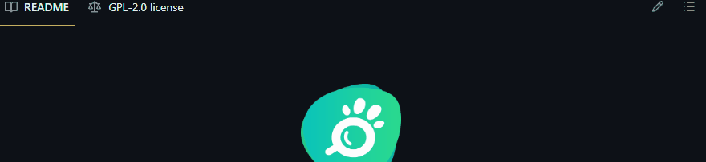

# Projeto com README

Um projeto de teste com um arquivo README 👍

[](https://github.com/animavita/animavita)

## Tecnologias utilizadas
- HTML
- CSS 
- JS

## Como utilizar

1 - Clone o projeto
```
git clone <url>
```

2 - Acesse a pasta do projeto
```
cd repositorio-com-readme
```

